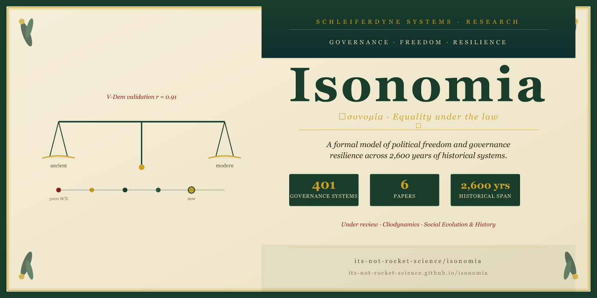

# Isonomia

[](https://its-not-rocket-science.github.io/isonomia/)
[](https://its-not-rocket-science.github.io/isonomia/)
[](https://its-not-rocket-science.github.io/isonomia/)
[](LICENSE)

*Ἰσονομία — equality under the law.*

A formal model of political freedom, legal equality, and governance resilience across roughly 2,600 years of historical systems. Data, code, and papers.

**[→ Interactive research site](https://its-not-rocket-science.github.io/isonomia/)**

---

## Overview

Isonomia addresses a gap in comparative politics: most quantitative governance datasets cover the modern era, treat freedom as a single variable, and provide no formal model of *why* systems persist or collapse. This project builds a formal model from first principles and tests it against historical data spanning ancient city-states, tribal confederacies, empires, colonial systems, and modern democracies.

The model formalises three properties:

- **Legal equality** — the degree to which law applies uniformly across persons and groups
- **Political freedom** — the degree to which subjects can participate in, contest, and exit governance
- **Resilience** — the structural conditions under which systems persist under internal and external stress

---

## Dataset

| Attribute | Value |
|---|---|
| Governance systems | 401 |
| Historical span | 401 systems from deep prehistory to the present; core statistical analyses span 2,600 years |
| Variables per system | 24 |
| Validation against V-Dem | r = 0.84 (n = 15 matched systems) |
| Validation against Polity5 | r = 0.82 (n = 15 matched systems) |
| Validation against WJP Rule of Law | r = 0.83 |

---

## Papers

Six papers are in preparation or under review.

| # | Title | Target journal | Status |
|---|-------|----------------|--------|
| 1 | The Isonomia Index | JWSR | Under review |
| 2 | The Lock-in Sequence | JWSR / CPS | Ready to submit |
| 3 | Succession and the CTMC | JMS / Social Networks | Ready to submit |
| 4 | Schismogenesis ABM | JASSS | Draft complete |
| 5 | Hegemonic Drift | Social Evolution & History | Under review |
| Synthesis | Isonomia: A Formal Model… | Cliodynamics | Under review |

> Reproduced system-level validation: V-Dem r = 0.84, Polity5 r = 0.82 (n = 15 matched systems, p < 0.001). Full validation table in Paper 1 and the [Reliability section](https://its-not-rocket-science.github.io/isonomia/#reliability) of the site.

---

## Research site

The [interactive Pages site](https://its-not-rocket-science.github.io/isonomia/) includes eleven interactive sections:

- **Phase-space explorer** — 401 systems in S-D space; filter by region, epoch, economic base
- **Trajectory explorer** — trace individual systems through time
- **Ecology of freedom** — latitude, economic base, and binding mechanism correlates
- **Succession dynamics** — CTMC-based succession mechanism analysis
- **Recovery depth** — elite reform vs external shock recovery mechanisms
- **Survival analysis** — Kaplan-Meier curves for time to D-threshold crossing
- **Governance archetypes** — DTW trajectory clusters, quadrant transitions, LCA
- **A-decomposition and arrangement freedom** — normalising fraction and R analysis
- **Schismogenesis ABM** — Paper 4 agent-based model results and G-W case studies
- **Validation tables** — full comparison against V-Dem, Polity5, WJP, Freedom House, Seshat
- **Reliability** — coding confidence, circularity, and evidence-strength ratings

---

## Repository structure

```
isonomia/
├── data/
│   ├── governance_extended.csv        # Master dataset (401 systems, 24 variables)
│   ├── d_trajectory_parsed.csv        # Time-series D data (30 systems)
│   ├── succession_events.csv          # Succession transition events (57 events)
│   ├── network_edges.csv              # Governance citation network (773 edges)
│   └── network_nodes.csv             # Network nodes (353 systems)
├── src/
│   ├── ecology_of_freedom.py          # Latitude, economic base, binding mechanism
│   ├── supplementary_analysis.py      # Brittleness, seasonality, gender
│   ├── survival_analysis.py           # Kaplan-Meier, Cox PH, time to threshold
│   ├── trajectory_cluster_lca.py      # DTW clustering, quadrant transitions, GMM LCA
│   ├── recovery_depth.py              # Recovery mechanisms
│   ├── a_decomposition.py             # Normalising fraction and arrangement freedom
│   ├── succession_events.py           # Succession event parsing and CTMC
│   ├── schismogenesis_abm.py          # Paper 4 agent-based model
│   └── generate_network.py            # Generates network_edges/nodes CSVs
├── docs/
│   └── index.html                     # GitHub Pages site (self-contained)
├── visuals/                           # Generated figures
└── papers/                            # Paper drafts (anonymised for review)
```

---

## Reproducing the results

```bash
pip install -r requirements.txt

# Individual analyses
python src/ecology_of_freedom.py
python src/supplementary_analysis.py
python src/survival_analysis.py
python src/trajectory_cluster_lca.py
python src/recovery_depth.py
python src/a_decomposition.py

# Network data (required before schismogenesis ABM)
python src/generate_network.py

# Schismogenesis ABM (Paper 4)
python src/schismogenesis_abm.py --no-sweep   # fast demo (~2 min)
python src/schismogenesis_abm.py              # full parameter sweep (~20 min)
```

Each script writes figures to `visuals/` and prints a results summary to stdout. All scripts are self-contained and read from `data/`.

---

## Related projects

- [global-governance-models](https://github.com/its-not-rocket-science/global-governance-models) — historical governance dataset
- [eunomia](https://github.com/its-not-rocket-science/eunomia) — computational governance reasoning
- [tensor-based-game-theory…](https://github.com/its-not-rocket-science/tensor-based-game-theory-identifying-critical-coalitions-climate-change-negotiations) — related formal methods work

---

## Data licence

Code: MIT.
Data: [CC BY 4.0](https://creativecommons.org/licenses/by/4.0/). Please cite the repository and note that historical data is estimated. Coding confidence ratings are included in `data/governance_extended.csv` (column: `coding_confidence`).

---

Dr Paul Schleifer · [ORCID 0009-0004-7972-3566](https://orcid.org/0009-0004-7972-3566) · London, UK
